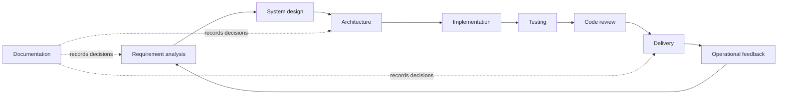
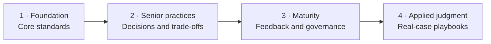

# Engineering Playbook

> Practical engineering standards for making sound technical decisions and delivering maintainable software.

A curated knowledge base for senior engineers, staff engineers, technical leads, and software architects. It captures the reasoning, review practices, and delivery standards that support the wider engineering portfolio.

## What this playbook provides

| Area | Outcome |
| --- | --- |
| Principles | Establish durable guidance without prescribing one solution everywhere. |
| Decision frameworks | Make context, constraints, alternatives, and trade-offs explicit. |
| Review practices | Evaluate requirements, designs, code, tests, and delivery readiness consistently. |
| Checklists | Reduce avoidable omissions in recurring engineering work. |
| Templates | Produce concise, reviewable engineering artifacts. |
| Lessons learned | Turn production and delivery experience into reusable guidance. |

## Scope

This repository explains how professional software engineering should be practiced. Its guidance is technology-neutral unless a specific technology is necessary to clarify a decision.

### Repository responsibility

This repository owns technology-neutral decision methods, review practices, and evidence standards. It explains how engineers evaluate context, alternatives, trade-offs, risks, and outcomes. It does not own framework defaults, starter-project structure, package selection, generated code, or runtime-specific implementation contracts.

Implementation repositories may apply these standards through concrete technology decisions and automated controls. Those repositories remain responsible for proving that their defaults work in their own runtime and delivery context.

### Included

- requirement analysis and validation
- system design and software architecture
- maintainable implementation practices
- testing strategy and code review
- safe software delivery
- durable technical documentation
- engineering governance and decision-making

### Excluded

- demo applications and starter projects
- framework-specific tutorials
- textbook summaries without practical context
- personal preferences presented as standards
- pattern-driven or speculative architecture
- large empty folder taxonomies

## How the knowledge areas connect

Engineering work is iterative. Requirements inform design; design guides implementation; testing and review provide evidence; delivery puts the change into operation; documentation preserves the decisions and feedback for the next cycle.

## Explore the playbook

### Repository standards

| Area | Purpose |
| --- | --- |
| [Standards](standards/README.md) | Define writing, terminology, decision-record, and content-quality rules. |
| [Templates](templates/README.md) | Provide reusable formats for reviews, decisions, risks, tests, and incidents. |

### Engineering domains

| Domain | Primary question |
| --- | --- |
| [Requirement analysis](docs/requirement-analysis/README.md) | Are we solving the right problem with clear, validated requirements? |
| [System design](docs/system-design/README.md) | Does the proposed system satisfy its constraints and quality attributes? |
| [Architecture](docs/architecture/README.md) | Will the system structure remain coherent as requirements evolve? |
| [Implementation](docs/implementation/README.md) | Can the design become maintainable, production-quality software? |
| [Testing](docs/testing/README.md) | What evidence is needed to trust the change? |
| [Code review](docs/code-review/README.md) | Is the change correct, understandable, testable, and safe to maintain? |
| [Delivery](docs/delivery/README.md) | Can the change reach users safely and recoverably? |
| [Documentation](docs/documentation/README.md) | Can future engineers understand and operate what was decided? |

## Roadmap

The repository grows through four maturity stages. Each milestone represents roughly two months of focused work, but quality—not elapsed time—determines completion.

### Milestone 1 — Foundation and core engineering standards

Build a small, useful foundation across requirements, design, architecture, implementation, testing, review, delivery, and documentation.

### Milestone 2 — High-value senior engineering practices

Add requirement clarification, ambiguity detection, scope breakdown, estimation, validation, risk analysis, trade-off analysis, design review, architecture decisions, and common failure modes.

### Milestone 3 — Maturity, feedback, and governance

Improve content consistency, terminology, review quality, maturity assessment, contribution gates, and repository governance.

### Milestone 4 — Practical real-case playbooks

Apply the guidance to reviewed cases involving requirements, estimation, scope reduction, architecture decisions, code review, incidents, delivery risks, and technical leadership.

See [ROADMAP.md](ROADMAP.md) for the maintained roadmap.

## Engineering principles

1. Start with the problem, context, and constraints.
2. Make decisions from evidence and explicit trade-offs.
3. Prefer the simplest approach that satisfies current requirements.
4. Add abstractions, rules, and processes only when they solve a concrete problem.
5. Validate assumptions before implementation and outcomes after delivery.
6. Treat documentation as part of the engineering system.
7. Evolve guidance through production evidence and respectful review.

## Contributing

Contributions are welcome when they improve correctness, clarity, or practical usefulness. This repository is curated; it is not a personal blog, discussion forum, or technology debate space.

Read the [contributing rules](CONTRIBUTING.md) before opening an issue or pull request. Submissions must provide practical context, clear reasoning, relevant trade-offs, and a professional collaboration standard.

## Project governance

- [Governance](GOVERNANCE.md) — ownership and decision authority
- [Code of Conduct](CODE_OF_CONDUCT.md) — collaboration expectations
- [Security Policy](SECURITY.md) — private vulnerability reporting
- [Changelog](CHANGELOG.md) — notable repository changes

## License

Licensed under the [MIT License](LICENSE).
