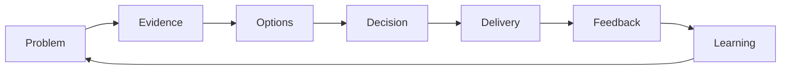

# Engineering Playbook

> Practical ways to make sound engineering decisions, deliver safely, and learn without blame.

This playbook helps people make better software decisions together. You do not need to read it from beginning to end, follow one delivery framework, or hold an engineering title to use it.

## Repository focus

The repository focuses on engineering decisions that recur across software work, regardless of stack or delivery framework:

| Focus domain | What the playbook helps decide |
| --- | --- |
| Requirement analysis | What outcome is being asked for, what is still uncertain, and what evidence makes work ready. |
| System design | How constraints, quality needs, and trade-offs shape a testable design decision. |
| Software architecture | Where ownership, boundaries, dependencies, integration, and evolution should sit. |
| Implementation | How code stays understandable, changeable, correct, and explicit about failure behavior. |
| Testing | Which evidence is credible for the failure risks that matter. |
| Code review | Whether a specific change is safe, understandable, and sufficiently proven. |
| Delivery | How a change moves to users with traceability, risk control, and recovery. |
| Documentation | Which decisions, contracts, tasks, and recovery knowledge are worth maintaining. |
| Ways of working | How the same decisions connect across real delivery situations and learning loops. |

The goal is not to teach every engineering topic. The goal is to help a reader identify the decision in front of them, understand the consequence of getting it wrong, choose the smallest useful practice, and leave behind evidence that another person can review.

## Presentation contract

Content should be practical, not encyclopedic. Each guide should make the reader's next decision easier.

- Start from a real situation, role, decision, or risk.
- Explain the outcome and consequence before deep technical detail.
- Keep one authoritative source for each decision; use indexes and journeys only for navigation.
- Present trade-offs, evidence, owners, and review questions instead of universal rules.
- Use examples as bounded illustrations, not invented proof.
- Preserve framework neutrality: Scrum, Kanban, continuous flow, and hybrid teams can all apply the same decision guidance.

## The decision-to-learning loop

This model answers: **How does the playbook move from a problem to better future decisions?**

> **Working maxim:** Use the smallest practice that protects a named outcome.

The loop is the stable core. Guides and templates add only the reasoning or evidence needed at the current decision.

## Start with the work in front of you

Use the smallest path that matches the work moment. The playbook serves developers, product practitioners, leaders, and business readers; it still keeps the writing concrete enough that an engineer can apply the guidance during real delivery work.

| Work moment | Start here | Useful outcome |
| --- | --- | --- |
| An idea is valuable but unclear | [Clarify an idea](docs/ways-of-working/README.md#1-from-an-unclear-idea-to-a-testable-slice) | A small, testable outcome with visible assumptions. |
| A requirement or scope decision feels ambiguous | [Requirement analysis](docs/requirement-analysis/README.md) | Shared language, visible uncertainty, and reviewable acceptance evidence. |
| A solution has meaningful alternatives | [System design](docs/system-design/README.md) | A trade-off decision with explicit drivers, consequences, and owner. |
| A code change needs safe implementation judgment | [Implementation](docs/implementation/README.md), [testing](docs/testing/README.md), and [code review](docs/code-review/README.md) | Correct behavior, credible evidence, and a reviewable merge decision. |
| A risky change is moving toward users | [Take a risky change to release](docs/ways-of-working/README.md#2-from-a-risky-change-to-a-safe-release) | Shared evidence for implementation, release, and recovery. |
| A poor outcome or incident needs learning | [Learn without blame](docs/ways-of-working/README.md#3-from-an-outcome-to-a-learning-experiment) | One owned experiment with a success signal and review date. |
| You know the current delivery step | [Follow the delivery flow](docs/ways-of-working/delivery-flow.md) | The relevant decision guide without adopting a new process. |
| You know the technical decision domain | [Browse engineering domains](docs/README.md) | Detailed reasoning, trade-offs, and review evidence. |

## Start with your role

Each path points to the same authoritative guides. The role changes the question you bring, not the engineering truth.

| You are... | Begin with... | Focus on... |
| --- | --- | --- |
| New to software delivery or joining a team | [Ways of working](docs/ways-of-working/README.md) | What decision is being made, why it matters, and what happens next. |
| Developer or reviewer | [Implementation](docs/implementation/README.md), [testing](docs/testing/README.md), and [code review](docs/code-review/README.md) | Correctness, maintainability, evidence, and safe change. |
| Product owner or product practitioner | [Requirement analysis](docs/requirement-analysis/README.md) and [scope breakdown](docs/requirement-analysis/scope-breakdown.md) | User outcome, scope, uncertainty, and validation. |
| Engineering lead or architect | [System design](docs/system-design/README.md), [architecture](docs/architecture/README.md), and [scaling without bureaucracy](docs/ways-of-working/scaling-without-bureaucracy.md) | Trade-offs, ownership, risk, and evolution. |
| CIO, CEO, or business leader | [Problem framing](docs/system-design/problem-framing.md), [delivery risk](docs/delivery/delivery-risk.md), and [scaling without bureaucracy](docs/ways-of-working/scaling-without-bureaucracy.md) | Business consequence, decision ownership, exposure, and recovery. |

Leaders should be able to understand the decision, consequence, risk, and owner without reading implementation detail. Deep technical guides remain written for the people who apply or review that detail.

## Use it with Scrum, Kanban, or a hybrid

The playbook is workflow-first. It starts from decisions that delivery teams face, then shows where those decisions may occur in Scrum, Kanban, continuous flow, or a hybrid model.

- Scrum events are possible decision touchpoints, not mandatory containers for every practice.
- Kanban policies and feedback loops can expose the same decisions without copying the guidance.
- Hybrid teams can select the smallest useful practice at the moment it is needed.
- The domain guide remains the authoritative source; framework mappings are navigation aids.

See [Delivery Flow](docs/ways-of-working/delivery-flow.md) for the mapping.

## How each guide should work

The playbook uses progressive depth so readers can stop when they have enough information:

1. **Understand** — the problem, why it matters, and the consequence of ignoring it.
2. **Apply** — the smallest useful action, evidence, or template for the current situation.
3. **Deep dive** — alternatives, trade-offs, failure modes, and technical review detail.

Not every guide needs identical headings. Every guide does need a clear reader outcome.

## What this playbook provides

| Area | Outcome |
| --- | --- |
| Principles | Durable decision heuristics with stated limits and costs. |
| Decision frameworks | Explicit context, constraints, alternatives, and trade-offs. |
| Review practices | Proportionate evaluation of requirements, designs, code, tests, and delivery. |
| Templates | Concise artifacts that make consequential work reviewable. |
| Learning practices | Evidence-based improvement without assigning personal blame. |
| Ways of working | Practical entry points that do not require one delivery framework. |

## Scope and responsibility

This repository owns technology-neutral decision methods, review practices, and evidence standards. It does not own framework defaults, starter-project structure, package selection, generated code, or runtime-specific implementation contracts.

Implementation repositories may apply this guidance through concrete technology choices and automated controls. They remain responsible for proving that their defaults work in their own runtime and delivery context.

The playbook includes requirement analysis, design, architecture, implementation, testing, review, delivery, documentation, decision governance, and learning from outcomes. It excludes framework-specific tutorials, textbook summaries without a practical decision, personal preference presented as policy, and speculative architecture.

## Browse the sources

| Source | Purpose |
| --- | --- |
| [Ways of working](docs/ways-of-working/README.md) | Enter through a real situation and connect practices across domains. |
| [Scaling without bureaucracy](docs/ways-of-working/scaling-without-bureaucracy.md) | Apply stable principles across teams while keeping context-specific decisions local. |
| [Engineering domains](docs/README.md) | Find the authoritative guide for a technical decision. |
| [Standards](standards/README.md) | Review content quality, language, evidence, and maintenance. |
| [Templates](templates/README.md) | Record decisions, risks, reviews, incidents, and improvement experiments. |
| [Roadmap](ROADMAP.md) | See current priorities and evidence-based completion criteria. |
| [Content audit](CONTENT_AUDIT.md) | See what is ready, what needs adaptation, and why the current result is partial. |

## Contribute a useful lesson

Contributions are welcome when they help a named reader make a decision, complete a task, reduce a risk, or learn from an observed outcome. A failed experiment can be valuable evidence when it explains system conditions, protects sensitive information, and proposes what to try next.

Read [Contributing](CONTRIBUTING.md) for a small path from observation to useful guidance. Repository quality controls are strict; engineering practices are not turned into mandatory policy without an enforceable reason.

## Project governance

- [Governance](GOVERNANCE.md) — ownership and decision authority
- [Code of Conduct](CODE_OF_CONDUCT.md) — collaboration expectations
- [Security Policy](SECURITY.md) — private vulnerability reporting
- [Changelog](CHANGELOG.md) — notable repository changes

## License

Licensed under the [MIT License](LICENSE).
