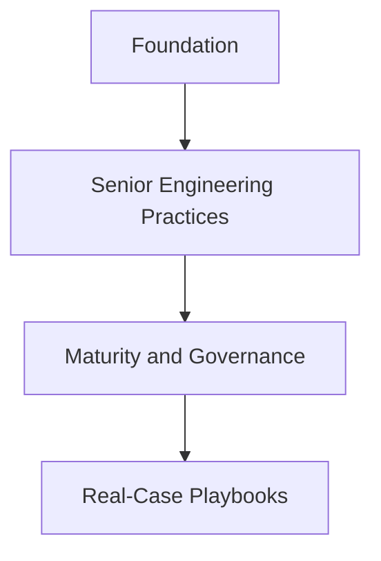

# Engineering Playbook

A practical software engineering handbook for senior engineers, staff engineers, technical leads, and software architects. It is the standards source for the wider engineering portfolio.

## Scope

The playbook covers principles, decision frameworks, checklists, templates, practical guidance, and lessons learned. It excludes demo applications, framework tutorials, copied textbook patterns, speculative abstractions, and empty taxonomies.

## Roadmap

### Milestone 1 — Foundation and core engineering standards

Build a small, useful foundation across requirements, design, architecture, implementation, testing, review, delivery, and documentation.

### Milestone 2 — High-value senior engineering sections

Add clarification, ambiguity detection, scope breakdown, estimation, validation, risk analysis, design review, decision records, and common failures.

### Milestone 3 — Maturity, feedback, and governance

Improve consistency, terminology, quality review, maturity assessment, contribution gates, and governance.

### Milestone 4 — Practical real-case playbooks

Add reviewed cases covering requirements, estimation, scope reduction, architecture decisions, reviews, incidents, delivery risks, and leadership.

## Evolution

```text
Foundation
   ↓
Senior Engineering Practices
   ↓
Maturity and Governance
   ↓
Real-Case Playbooks
```



## Document index

- [Standards](standards/README.md) — repository-wide writing and quality rules.
- [Templates](templates/README.md) — reusable review and decision formats.
- [Requirement analysis](docs/requirement-analysis/README.md) — clarify and validate requirements.
- [System design](docs/system-design/README.md) — frame systems and compare trade-offs.
- [Architecture](docs/architecture/README.md) — guide boundaries and evolution.
- [Implementation](docs/implementation/README.md) — build maintainable production software.
- [Testing](docs/testing/README.md) — select evidence proportionate to risk.
- [Code review](docs/code-review/README.md) — review correctness, design, and risk.
- [Delivery](docs/delivery/README.md) — deliver changes safely.
- [Documentation](docs/documentation/README.md) — preserve engineering context.

## Contributing

Read [CONTRIBUTING.md](CONTRIBUTING.md). Contributions are curated for evidence, practical value, and respectful collaboration.

## License

Licensed under the [MIT License](LICENSE).
