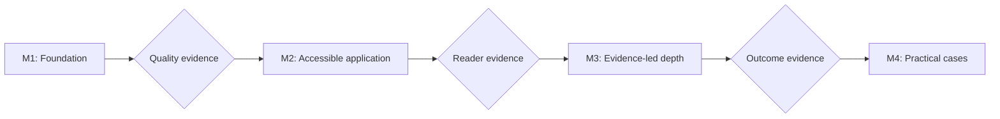

# Roadmap

The roadmap advances through evidence and reader outcomes, not file count or elapsed time. New domain breadth pauses until people can find, understand, and apply the existing guidance.

## Maturity gates

This model answers: **What evidence allows the playbook to advance without confusing more content with greater maturity?**

Each gate requires observable evidence from the previous stage. Elapsed time, file count, and polished presentation do not open a gate.

## Milestone 1 — Foundation and core engineering standards

### Status

Complete. The repository contains substantive domain guidance, enforceable content standards, purpose-specific templates, contribution governance, and automated documentation hygiene.

### Preserved exit evidence

- Eight engineering domains have decision-oriented indexes and substantive guides.
- The document contract, writing rules, content quality, terminology, decision records, and contribution review have enforceable acceptance criteria.
- Templates have distinct decision purposes and observable evidence fields.
- Root and domain navigation, Markdown lint, and internal links are validated.
- Completion was based on decision value and review evidence rather than file presence.

## Milestone 2 — Accessible application and learning culture

### Outcome

People with different roles can enter through a real situation, understand the consequence at the depth they need, and apply one authoritative practice in Scrum, Kanban, continuous flow, or a hybrid without creating duplicate guidance.

### Current status: PARTIAL

Repository implementation can establish the information architecture and review contracts. Completion also requires usability evidence from real technical, product, and leadership readers.

### Exit criteria

- [x] Root navigation provides paths for newcomers, developers, product owners, engineering leaders, and CIO/CEO readers.
- [x] Guidance uses progressive depth: understand, apply, and deep dive where multiple knowledge levels need it.
- [x] A workflow-first map connects Scrum and Kanban touchpoints to one authoritative source.
- [x] Three end-to-end journeys cover unclear ideas, risky changes, and learning from poor outcomes.
- [x] Ten bounded visual models support a 30-minute senior learning path without adding image assets or technology-specific authority.
- [x] Organizational scaling separates durable principles, cross-boundary guardrails, local adaptation, and evidence feedback.
- [x] Six simplified examples and five working maxims support decisions without being presented as evidence.
- [x] Contribution and learning guidance accept evidence-backed failed experiments without personal blame.
- [x] Mandatory language is limited to enforceable or necessary conditions by repository standards.
- [ ] A technical reader, product reader, and leadership reader can each find a relevant starting point within two navigation choices.
- [ ] Those readers can explain the decision, consequence, owner, and next action at their required depth.
- [ ] A senior reader can explain the visual decision loop, route three pilot situations, and distinguish shared guardrails from local practice within 30 minutes.
- [ ] Reader feedback is recorded, material failures are corrected, and the review result is published without invented evidence.

## Milestone 3 — Evidence-led depth and controlled expansion

### Outcome

Deepen decision guidance only where reader feedback, delivery evidence, or repeated failure shows a real gap.

### Focus

- classify guides as keep, adapt, rewrite, or merge/remove;
- improve content by end-to-end reader journey rather than folder-wide cosmetic rewrites;
- deepen requirement, estimation, risk, architecture, and delivery decisions when evidence justifies it;
- preserve stable URLs and point superseded guidance to its successor;
- separate time-sensitive examples from durable principles;
- audit terminology, mandatory language, duplication, ownership, and maintenance triggers.

### Entry condition

Milestone 2 repository checks pass and unresolved usability gaps are visible. New content has real project evidence or is labeled as a bounded framework.

## Milestone 4 — Practical cases and measurable learning

### Outcome

Demonstrate engineering judgment using sanitized, evidence-backed cases and use their outcomes to improve the authoritative guidance.

### Evidence requirement

Each case states its source context, constraints, decision, positive and negative consequences, anonymization boundary, and transferable lesson. Fictional examples are labeled and are never presented as project evidence.

### Completion signals

- Cases cover requirement, scope, architecture, delivery, incident, and leadership decisions only where source evidence exists.
- Repeated outcomes update or retire a guide, template, or control.
- Reader and contributor feedback shows which decisions became easier, not merely which pages received more activity.
