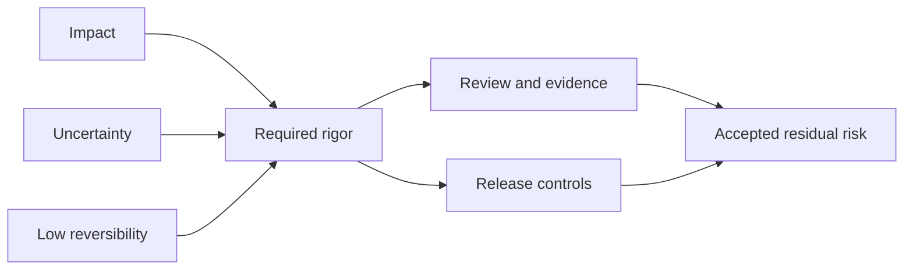

# Delivery Risk

## At a glance

Engineering and business owners use this guide before releasing a change that could harm users, data, operations, commitments, or recovery capability. The decision is not whether risk exists; it is which exposure is reduced, which remains, and who can pause or accept the release.

## Proportional rigor model

This model answers: **When should review, evidence, and release control become stronger?**

Change size is not an input. A small change can require strong control when its consequence is broad and recovery is weak.

## Decision supported

Identify how the act of releasing a change can create harm and select controls proportionate to impact, uncertainty, and reversibility.

## Risk dimensions

Evaluate:

- blast radius and affected users or operations;
- data mutation, migration, and reversibility;
- dependency and contract coordination;
- authorization, secrets, and supply-chain exposure;
- observability and time to detect harm;
- recovery time and required human authority;
- release timing, support coverage, and external commitments.

Risk is not change size alone. A one-line permission or migration change can exceed the risk of a large isolated refactor.

## Decision guide

1. State the credible harmful outcome, not a generic risk label.
2. Estimate impact, likelihood, detectability, and recovery difficulty using available evidence.
3. Reduce exposure through smaller scope, staged rollout, compatibility, automation, or containment.
4. Assign residual risk to an accountable owner.
5. Define triggers that pause rollout or require escalation.
6. Review actual delivery outcomes and update controls.

## Simplified example

A one-line authorization condition changes who can view every account. The code diff is small, but impact is broad, misuse may be difficult to detect, and reversal cannot erase prior exposure. Review depth and staged validation follow that consequence rather than line count.

## Trade-offs

Risk controls reduce exposure but add lead time and operational complexity. Apply controls to the risk they reduce; remove those that produce no decision value.

## Failure modes

- Using “low risk” because the diff is small.
- Listing risks without triggers, controls, or owners.
- Applying the same release process to reversible and irreversible changes.
- Measuring successful deployment while user outcomes degrade.

## Review evidence

- [ ] Each material risk names a harmful outcome and affected boundary.
- [ ] Controls reduce likelihood, impact, detection time, or recovery time.
- [ ] Residual risk has explicit acceptance.
- [ ] Release telemetry verifies both technical health and intended outcome.

## Maintenance trigger

Review this guide when delivery outcomes show that controls missed a material exposure or add delay without changing risk, detection, or recovery.
