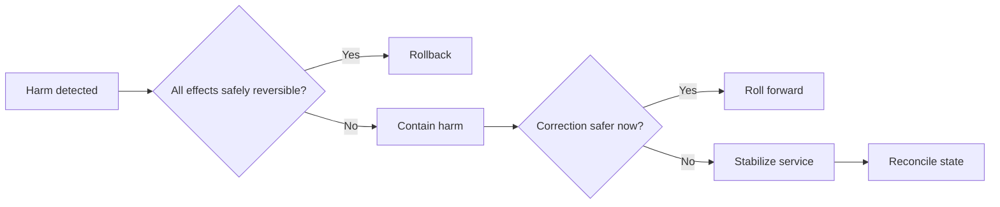

# Rollback and Recovery

## When to use this

Release owners, operators, engineers, and accountable leaders use this guide to reduce harm when a release fails. A previous artifact is not a complete rollback if data, configuration, contracts, or external effects cannot move backward safely; containment, roll-forward, or reconciliation may be required.

## Recovery decision tree

This model answers: **When is rollback safer than containment, roll-forward, or state repair?**

> **Working maxim:** A previous artifact is not a rollback when state cannot move back.

Contain first when the state is uncertain. Diagnosis can continue after the harmful path is bounded.

## Decision supported

Select the fastest safe action to reduce harm after a release when software, data, contracts, or external effects may not be reversible together.

## Recovery options

- **Rollback:** restore a previous compatible artifact or configuration.
- **Roll forward:** deploy a corrective change when state or contracts cannot move backward safely.
- **Disable:** use a feature or operational control to stop the harmful path.
- **Contain:** limit traffic, tenants, operations, or integrations while preserving safe service.
- **Reconcile:** repair partial or inconsistent state after behavior is stabilized.

## Decision guide

1. Define failure signals and the person authorized to act.
2. Identify reversible and irreversible parts of the release.
3. Test artifact, configuration, schema, and data compatibility in both directions where rollback is claimed.
4. Prefer containment when diagnosis is incomplete and rollback may worsen state.
5. Preserve evidence while reducing impact; do not delay recovery for full root cause.
6. Verify service and data state after action, then reconcile affected work.

## Simplified example

A release writes a new schema that the previous binary cannot read. Redeploying that binary would deepen the outage. Stop new writes, deploy a compatible correction, verify state, and reconcile work accepted during the failure window.

## Trade-offs

Backward-compatible migration preserves rollback but requires temporary dual support. Fast roll-forward avoids backward constraints but depends on diagnosis and deployment speed.

## Failure modes

- Calling artifact redeployment a rollback while schema or data is irreversible.
- Discovering missing permissions or runbooks during an incident.
- Repeated automated rollback causing oscillation.
- Restoring availability without checking data correctness.

## Evidence to keep

- [ ] Recovery choice accounts for code, configuration, contract, and data state.
- [ ] Trigger, authority, procedure, and verification are explicit.
- [ ] Irreversible effects have containment and reconciliation plans.
- [ ] Recovery capability has been exercised at realistic boundaries.

## Maintenance trigger

Review this guide after a recovery exercise or incident exposes a missing trigger, authority, permission, compatibility assumption, or state-repair path.
