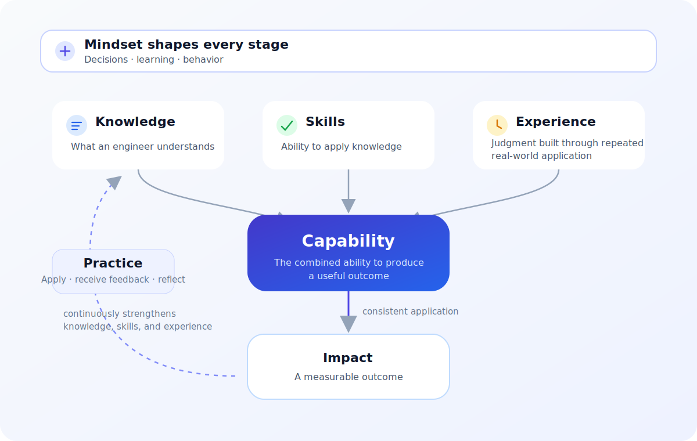

# Capability in Software Engineering

Capability is an engineer's demonstrated ability to produce a useful outcome under real constraints. It is more than knowing a concept or completing a task once. It combines understanding, application, judgment, and repeated learning so that sound results can be produced consistently.

This explanation helps engineers, reviewers, and engineering leaders distinguish capability from its ingredients and from the impact it may create. It is a development and review model, not a universal competency framework or a method for ranking people.

## The elements of capability

| Element | Meaning | Observable evidence |
| --- | --- | --- |
| **Knowledge** | What an engineer understands, including concepts, constraints, terminology, and reasons behind possible choices. | The engineer can explain a problem, identify relevant constraints, and compare credible options. |
| **Skills** | The ability to apply knowledge to perform a task. | The engineer can use an appropriate method or tool and produce a reviewable result. |
| **Experience** | Judgment developed through repeated real-world application, feedback, variation, and consequences. | The engineer recognizes relevant patterns, adapts to context, and anticipates plausible failure modes. |
| **Mindset** | The assumptions and attitudes that influence decisions, learning, and behavior. | The engineer seeks evidence, makes uncertainty visible, accepts feedback, and revises decisions when conditions change. |
| **Practice** | Repeated application with feedback and reflection. | The engineer deliberately exercises the relevant work, reviews outcomes, and adjusts the next attempt. |
| **Impact** | The measurable outcome created by applying capability consistently in a particular context. | A named user, system, delivery, or business condition changes in an observable way. |

These elements are related but not interchangeable. Reading about incident response builds knowledge; facilitating a review exercises skills; encountering different incidents and seeing the consequences builds experience. A learning-oriented mindset affects how evidence and feedback are handled throughout. Practice connects the attempts into a development loop.

## How capability emerges

The model below answers: **How do knowledge, skills, experience, mindset, and practice combine to produce capability and, eventually, impact?**

Knowledge provides the concepts and reasons needed to understand a situation. Skills turn that understanding into action. Repeated application exposes the engineer to variation, feedback, failure, and consequence; this is how experience develops. Practice is not another static input. It is the continuous mechanism that strengthens and connects the other elements.

Mindset surrounds the model because it affects every stage. It influences whether an engineer tests assumptions, seeks feedback, responds constructively to failure, and continues learning. Capability emerges from the combined system rather than from any single element.

Impact sits downstream for an important reason: capability describes a reliable ability, while impact describes the result of applying that ability in context. A capable engineer cannot guarantee impact alone because priorities, authority, team coordination, system conditions, and external events also influence outcomes.

## Required inputs depend on the outcome

There is no context-free list of required knowledge, skills, experience, or mindset. The useful starting point is a specific outcome and its constraints.

For a given responsibility, define the composition in this order:

1. **Expected outcome:** Name the observable change or protected condition.
2. **Operating context:** Identify constraints, risks, authority, and available feedback.
3. **Required knowledge:** State what must be understood to reason about the work.
4. **Required skills:** State what must be performed to turn that understanding into evidence or action.
5. **Required experience:** Identify the kinds of variation or consequence for which practiced judgment matters.
6. **Required mindset:** Describe the decision and learning behaviors the context needs.
7. **Resulting capability:** State what the engineer can reliably accomplish under the named conditions.

For example, “knows distributed systems” is too broad to assess. “Can design and review a retry policy that limits duplicate effects for this message-processing path” identifies a capability. Its requirements can then be made explicit: knowledge of delivery semantics, skill in tracing failure paths, experience with partial failure, and a mindset that treats assumptions as testable rather than certain.

## Capability is not a checklist total

A checklist can reveal missing evidence, but counting completed courses, tools used, or years worked does not establish capability. Common substitutions include:

- treating knowledge recall as proof of application;
- treating one successful attempt as reliable skill;
- treating time served as equivalent to relevant experience;
- describing mindset with personality labels instead of observable behavior;
- measuring practice by repetition without feedback or adjustment;
- claiming impact from activity or output without observing an outcome.

Capability should be evaluated through representative work and evidence proportionate to the consequence. Low-risk work may need a small demonstration and review. High-consequence responsibility may require evidence across varied conditions, including failure and recovery.

## Developing capability

Capability develops through a feedback loop rather than a fixed sequence:

1. Learn enough to explain the problem and recognize uncertainty.
2. Apply that knowledge to a bounded, representative task.
3. Review the result and its consequences with credible feedback.
4. Reflect on which assumptions, decisions, or techniques helped or failed.
5. Repeat under meaningful variation and gradually greater responsibility.
6. Update the underlying knowledge and approach using the observed outcome.

Repetition alone can reinforce a weak method. Useful practice includes timely feedback, reflection, and enough variation to test whether the engineer can adapt rather than reproduce one familiar answer.

## From capability to impact

Impact is evidence that applying capability changed a condition that matters. The measure should match the intended outcome and should not be reduced to individual output volume.

| Intended outcome | Weak proxy | More useful evidence |
| --- | --- | --- |
| Safer releases | Number of deployment tasks completed | Change failure, recovery, or prevented-risk evidence for the relevant release path |
| More maintainable software | Lines of code or refactoring count | Time and error rate for representative changes, supported by review evidence |
| Better technical decisions | Number of documents or meetings | Decisions with visible constraints, consequences, owners, and reconsideration triggers |
| Stronger team learning | Training hours | Observable improvements in later decisions, delivery, or recovery under similar conditions |

The same capability can produce different impact in different systems. Review both the engineer's demonstrated behavior and the surrounding conditions instead of attributing every outcome to one person.

## Questions for development and review

Use these questions to plan growth or review evidence without turning the model into a scoring formula:

- What outcome must this capability make more likely, and under which constraints?
- What must the engineer understand to explain the important decisions?
- What must the engineer be able to do, not merely describe?
- Which real-world variations or consequences require experienced judgment?
- Which observable behaviors support learning, sound decisions, and responsible action?
- What practice will provide representative work, feedback, reflection, and increasing variation?
- What evidence would demonstrate reliable capability rather than a one-time success?
- Which measurable outcome would indicate impact, and what other conditions influence it?

## Boundaries and maintenance

This model supports development conversations, responsibility design, and evidence-based review. It does not define job levels, promotion criteria, compensation decisions, or a universal set of engineering competencies. Organizations using it for those purposes need explicit role expectations, fair evidence standards, review ownership, and safeguards against bias.

Review this explanation when repeated use shows that the elements are ambiguous, the model encourages proxy measurement, or a more precise distinction is needed between individual capability and system-level outcomes.
