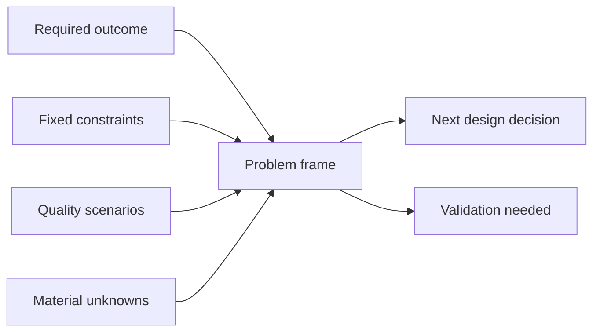

# Problem Framing

## At a glance

Product, business, and technical leaders use this guide before choosing a solution. It makes the intended outcome, decision owner, costly failure, and design-changing constraints visible. The next step is a problem frame that another person can review without assuming the requested technology is the requirement.

## Framing funnel

This model answers: **Which inputs are strong enough to shape the solution decision?**

Requested technologies and preferred patterns stay outside the frame until evidence shows that they are fixed constraints rather than solution ideas.

## Decision supported

Determine the required system outcome and which constraints can change the design before selecting architecture, storage, messaging, or infrastructure.

## Required evidence

- User or business outcome and observable success condition.
- Actors, workflows, trust boundaries, and decision owner.
- Current behavior, failure cost, and reason for change.
- Functional scope, non-goals, and external dependencies.
- Quality attributes expressed as scenarios rather than adjectives.

Replace “highly available” with a scenario such as the affected operation, failure condition, acceptable interruption, recovery target, and measurement source. Label numbers without evidence as assumptions.

## Framing method

1. Write the problem independently from the proposed solution.
2. Identify the few quality attributes that can force different system shapes.
3. Separate fixed constraints from negotiable preferences.
4. Record unknowns by decision impact and cost of validation.
5. Define what evidence would make the design acceptable.

Do not start component design while a disputed outcome, system boundary, or critical quality attribute can invalidate it.

## Trade-offs

More framing reduces solution churn but delays technical learning when uncertainty can be resolved only through a prototype. Time-box discovery and link every investigation to a pending decision.

## Failure modes

- Treating a requested technology as the problem statement.
- Listing every quality attribute as equally important.
- Inventing scale or reliability targets to make the design look complete.
- Ignoring migration, support, security, or team capability constraints.

## Review evidence

- [ ] Outcome and non-goals distinguish the problem from a preferred solution.
- [ ] Design-driving quality scenarios have measurable acceptance evidence.
- [ ] Fixed constraints, assumptions, and unknowns are separately visible.
- [ ] The next design decision and its owner are explicit.

## Maintenance trigger

Review this guide when repeated design reviews still discover disputed outcomes, hidden constraints, or invented quality targets after framing.
