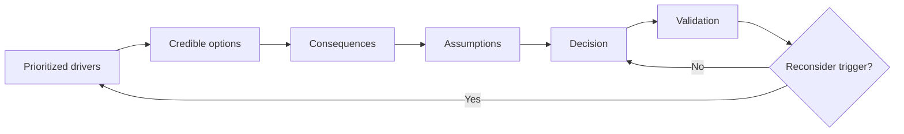

# Trade-off Analysis

## At a glance

Decision owners and specialists use this guide when more than one credible option exists and the consequences matter. Leaders should be able to see which business or operational drivers dominate, who accepts the negative consequences, and what evidence would reopen the decision.

## Decision loop

This model answers: **How do explicit drivers and consequences produce a reviewable choice?**

The loop reopens only when evidence or constraints change, not when a familiar option gains a stronger advocate.

## Decision supported

Choose among credible design options using explicit drivers rather than familiarity, trend, or pattern preference.

## Analysis method

1. State the decision and the latest responsible decision date.
2. List only drivers capable of changing the choice: correctness, reliability, latency, security, cost, delivery time, operability, and team capability as applicable.
3. Assign relative priority and explain the evidence behind it.
4. Compare at least two credible options, including the current or simplest approach.
5. Describe benefits, negative consequences, failure exposure, migration cost, and reversibility.
6. Identify assumptions that require a spike, measurement, or stakeholder decision.
7. Record the choice, rejected options, validation plan, and reconsideration trigger.

Do not use a numeric score to hide weak evidence. Scores summarize reasoning; they do not replace it.

## Simplified example

A report can return inside the original request or be accepted for later completion. Immediate return improves outcome visibility but may exceed the response-time constraint. Later completion protects the request path but adds status and recovery responsibility. Choose from the required user outcome and failure consequence, then validate the assumption with realistic report demand.

## Trade-offs

Detailed analysis improves consequential choices but becomes waste when a decision is cheap and reversible. Match rigor to impact, uncertainty, and reversal cost.

## Failure modes

- Comparing a detailed preferred option with weak straw alternatives.
- Treating every criterion as equal priority.
- Omitting operational and migration cost.
- Recording advantages while leaving negative consequences vague.
- Reopening a decision without new evidence or changed constraints.

## Review evidence

- [ ] The simplest viable option is represented fairly.
- [ ] Drivers are prioritized and traceable to real constraints.
- [ ] Negative consequences and reversal costs are explicit.
- [ ] Validation and reconsideration triggers are owned.

## Maintenance trigger

Review this guide when decisions repeatedly hide negative consequences, compare unfair alternatives, or reopen without changed evidence or constraints.
