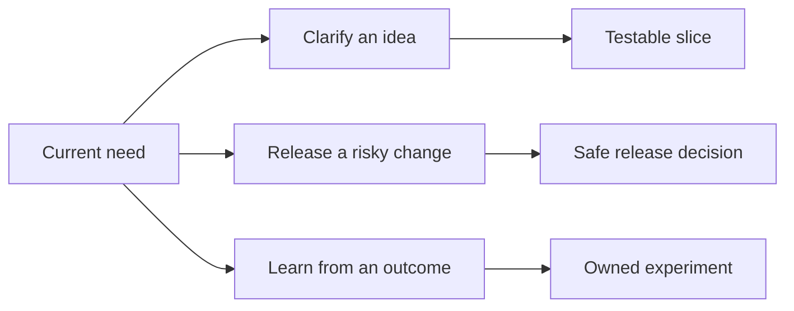

# Ways of Working

## Why this section exists

Engineering guidance is useful only when people can find it at the moment a decision is being made. This section connects the authoritative domain guides across real delivery situations. It does not define a new process or duplicate Scrum and Kanban manuals.

Use this section if you know the situation you face but do not yet know which engineering domain owns the decision.

## Three senior journeys

This model answers: **Which practical journey matches the current need?**

Choose one journey. Move into another only when the current decision exposes that need.

## Choose a path

| Current situation | First decision | Path |
| --- | --- | --- |
| An idea is valuable but unclear | What outcome is worth validating? | [Unclear idea to testable slice](#1-from-an-unclear-idea-to-a-testable-slice) |
| A change may create material harm | What evidence and recovery capability make it safe enough? | [Risky change to safe release](#2-from-a-risky-change-to-a-safe-release) |
| Delivery or production produced a poor outcome | What system condition should the team change and test? | [Outcome to learning experiment](#3-from-an-outcome-to-a-learning-experiment) |
| Work is already moving | Which decision belongs at the current work moment? | [Delivery flow](delivery-flow.md) |
| A team wants to improve without adding policy | What small experiment has a useful signal? | [Learning from outcomes](learning-from-outcomes.md) |
| Guidance needs to work across many teams | What belongs in the stable core, a shared guardrail, or local practice? | [Scaling without bureaucracy](scaling-without-bureaucracy.md) |

## Role lenses

The roles below use the same sources but need different information from them.

| Reader | Question to bring | Evidence to leave with |
| --- | --- | --- |
| Newcomer | What problem are we solving, and what happens next? | A plain-language outcome, owner, and next action. |
| Developer or reviewer | What behavior, boundary, and failure could this change affect? | Testable behavior and review evidence. |
| Product owner | What user outcome, assumption, and scope decision are we making? | A validated slice and visible uncertainty. |
| Engineering leader | What trade-off, dependency, and operational ownership are accepted? | An explicit decision and risk disposition. |
| CIO, CEO, or business leader | What business consequence, exposure, and recovery option matter? | Decision ownership and evidence proportionate to consequence. |

## 1. From an unclear idea to a testable slice

**Outcome:** product, engineering, and business participants agree on a small outcome that can produce evidence before a large commitment is made.

1. Use [problem framing](../system-design/problem-framing.md) to separate the desired outcome from a proposed solution.
2. Use [ambiguity detection](../requirement-analysis/ambiguity-detection.md) to expose terms that permit conflicting interpretations.
3. Use [validation before implementation](../requirement-analysis/validation-before-implementation.md) to select the cheapest credible way to test the important assumption.
4. Use [scope breakdown](../requirement-analysis/scope-breakdown.md) to create an end-to-end slice with an observable result.
5. Record the readiness decision with the [requirement review template](../../templates/requirement-review.md).

Do not require all five activities for a low-consequence, reversible change whose outcome and acceptance conditions are already clear.

## 2. From a risky change to a safe release

**Outcome:** the people responsible for implementation, release, and business impact share the evidence needed to proceed, limit exposure, and recover.

1. Use [trade-off analysis](../system-design/trade-off-analysis.md) to compare credible options against explicit drivers.
2. Use [design review](../system-design/design-review.md) to walk a success path and a consequential failure path.
3. Use [test strategy](../testing/test-strategy.md) to map material failures to credible evidence.
4. Use [delivery risk](../delivery/delivery-risk.md) to reduce release exposure in proportion to impact and reversibility.
5. Use [rollback and recovery](../delivery/rollback-and-recovery.md) to define signals, authority, and state recovery before release.
6. Capture unresolved exposure with the [risk assessment template](../../templates/risk-assessment.md).

For a routine, reversible change, use only the checks needed to explain why existing delivery controls are sufficient.

## 3. From an outcome to a learning experiment

**Outcome:** a team changes one system condition, observes the result, and learns without converting an untested idea into policy.

1. Choose the [incident review](../../templates/incident-review.md) when users, data, finances, security, or operations experienced material harm. Choose the [retrospective](../../templates/retrospective.md) for a delivery or collaboration outcome without incident-level impact.
2. Describe the intended and observed outcomes using available evidence.
3. Identify conditions that shaped the result. Do not label an individual action as the root cause.
4. Select a small, owned change that reduces a named condition.
5. Define the expected signal, possible negative consequence, and review date.
6. Keep, adapt, or stop the experiment after reviewing evidence.

See [Learning from Outcomes](learning-from-outcomes.md) for facilitation, escalation, and policy boundaries.

## Maintenance

The maintainers review these paths when a linked source moves, a recurring delivery decision has no path, or reader feedback shows that a role cannot identify its next action. Framework-specific terminology may change; the underlying decisions remain in the domain guides.
