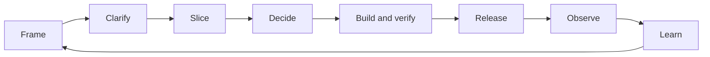

# Delivery Flow

## Decision supported

Find the smallest relevant engineering practice at the current work moment without forcing a team to adopt a different delivery framework.

Scrum touchpoints in this guide are events or activities where a decision may be made. Kanban touchpoints are policies or feedback loops where the same decision may become visible. Neither column overrides the authoritative guide or mandates a ceremony.

## Framework-neutral workflow

This model answers: **Where does the same engineering decision appear regardless of delivery framework?**

> **Working maxim:** A ceremony is a place to decide, not proof that a decision is sound.

Scrum events, Kanban policies, and hybrid routines are possible touchpoints around this flow. Evidence and decision ownership determine whether the work is sound.

## Flow map

| Work moment | Decision to make | Authoritative guide or template | Scrum touchpoint | Kanban touchpoint | Evidence to keep | Skip when |
| --- | --- | --- | --- | --- | --- | --- |
| Frame an opportunity | Is the problem important and understood well enough to investigate? | [Problem framing](../system-design/problem-framing.md) | Discovery or refinement before commitment | Replenishment or upstream discovery | Outcome, affected people, constraints, assumptions | The outcome and constraints are already explicit and undisputed. |
| Clarify expected behavior | Can reasonable readers agree on what success and failure mean? | [Ambiguity detection](../requirement-analysis/ambiguity-detection.md) and [requirement review](../../templates/requirement-review.md) | Refinement or planning | Replenishment and ready policy | Examples, boundaries, unresolved questions, owner | The change is low consequence, reversible, and already has observable acceptance conditions. |
| Shape a testable slice | What is the smallest end-to-end result that creates value or learning? | [Scope breakdown](../requirement-analysis/scope-breakdown.md) | Refinement or sprint planning | Replenishment and item splitting | Included outcome, exclusions, dependency decisions | The work is already independently deliverable and verifiable. |
| Compare solution options | Which option best fits the stated constraints and accepted consequences? | [Trade-off analysis](../system-design/trade-off-analysis.md) and [decision record](../../templates/decision-record.md) | Design activity inside or before a sprint | On-demand design review before commitment or during delivery | Drivers, alternatives, consequences, decision owner | One reversible option clearly satisfies the constraints and recording it adds no future value. |
| Review consequential design | Is enough known to implement and operate the change responsibly? | [Design review](../system-design/design-review.md) and [design review template](../../templates/design-review.md) | Before or during implementation as risk becomes known | Explicit review policy for high-risk work | Success and failure flows, ownership, unresolved risks | Existing design evidence covers the unchanged risk boundary. |
| Implement and verify | What behavior and failure evidence are needed before merge? | [Implementation](../implementation/README.md), [test strategy](../testing/test-strategy.md), and [code review](../code-review/README.md) | Daily delivery work and Definition of Done checks | In-progress policies, WIP limits, and pull criteria | Tests, review disposition, accepted risks | Never skip the required evidence for a material changed behavior; reuse existing evidence when it still covers the risk. |
| Release and recover | How will exposure be limited, detected, and reversed or repaired? | [Delivery risk](../delivery/delivery-risk.md) and [rollback and recovery](../delivery/rollback-and-recovery.md) | Release planning or completion checks | Delivery review, release policy, or service delivery review | Release decision, signals, authority, recovery path | Existing automated controls demonstrably cover a routine reversible change. |
| Observe and learn | What should be preserved, changed, escalated, or stopped? | [Learning from outcomes](learning-from-outcomes.md), [retrospective](../../templates/retrospective.md), or [incident review](../../templates/incident-review.md) | Sprint review, retrospective, or incident review | Operations review, service delivery review, or on-demand review | Observed outcome, system conditions, experiment, owner, review date | There is no new evidence, changed condition, or useful decision to make. |

## Use the map without creating process debt

1. Start from the work moment, not a preferred ceremony.
2. Open only the authoritative guide needed for the pending decision.
3. Scale evidence to consequence, uncertainty, and reversibility.
4. Reuse an existing artifact when it still answers the question; do not create a document to prove that a meeting happened.
5. Record an exception only when another person will need to understand the accepted consequence.

Adding every practice to every work item increases delay and hides which controls matter. Skipping all explicit reasoning makes risk and ownership invisible. The useful middle is a small control tied to a named decision or failure.

## Framework boundaries

- A Scrum team may make these decisions inside or outside formal events. The event is not evidence that the decision is sound.
- A Kanban team may encode recurring decisions in explicit policies. A policy should be removed when it no longer reduces a named risk or delay.
- A hybrid or continuous-flow team may combine touchpoints. It should preserve decision ownership and observable evidence rather than ceremony names.

## Verification

- A newcomer can identify the next relevant guide from the current work state.
- Product, engineering, and leadership can identify the decision owner and consequence at their required depth.
- Scrum and Kanban paths resolve to the same authoritative guide.
- No touchpoint is presented as mandatory without an enforceable external or organizational constraint.
