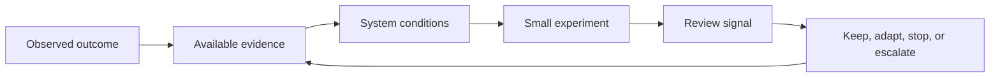

# Learning from Outcomes

## Why this matters

A poor outcome contains information about the system in which people worked: incentives, workload, tools, boundaries, assumptions, feedback, and recovery capability. Assigning blame to one person may feel decisive, but it hides conditions that can produce the same outcome again.

The goal is not to make failure consequence-free. The goal is to preserve accountability for decisions while improving the conditions that shape those decisions.

## Evidence-to-experiment loop

This model answers: **How does an outcome become learning without becoming blame or premature policy?**

> **Working maxim:** Blame ends inquiry; evidence improves the system.

The loop keeps an unvalidated idea reversible. A recurring policy requires stronger evidence and an owner who can maintain or remove it.

## Choose the right review

| Situation | Use | Expected outcome |
| --- | --- | --- |
| Material user, data, financial, security, or operational harm | [Incident review](../../templates/incident-review.md) | Reduced recurrence or recovery risk with residual risk explicitly owned. |
| Delivery, quality, or collaboration result differs from intent | [Retrospective](../../templates/retrospective.md) | One small improvement experiment the team can own. |
| Consequence requires a durable choice between alternatives | [Decision record](../../templates/decision-record.md) | A reviewable decision with consequences and reconsideration triggers. |
| Suspected misconduct, legal exposure, or a personnel matter | The responsible organizational process | Confidential handling outside a public engineering review. |

Do not force every disappointment into an incident process. Do not use a retrospective to avoid required security, legal, or management escalation.

## Facilitate the learning loop

### Understand the outcome

State the intended result, observed result, affected people or operations, and evidence. Separate observations from explanations. If evidence is missing, label the explanation as a hypothesis.

### Examine system conditions

Ask which conditions made the outcome more likely or recovery harder:

- unclear ownership or authority;
- conflicting incentives or commitments;
- missing or delayed feedback;
- workload, interruption, or work-in-progress pressure;
- unsafe defaults or weak boundaries;
- insufficient test, release, observability, or recovery capability;
- assumptions that were reasonable from the information available at the time.

Individual decisions remain reviewable. Describe the information, constraints, and expected outcome surrounding the decision rather than using the person as the causal explanation.

### Select one useful experiment

An improvement experiment states:

- the condition it aims to change;
- the smallest reversible action;
- the owner and start trigger;
- the expected benefit signal;
- a possible negative consequence or cost;
- the review date or observable review trigger.

Prefer one or two experiments the team can complete over a long action list that creates the appearance of control.

### Review and decide

At the review point, choose one disposition:

- **Keep:** evidence supports continuing the practice.
- **Adapt:** the signal is promising but the practice needs a bounded change.
- **Stop:** benefit is absent or cost exceeds value.
- **Escalate:** the condition sits outside the team's authority and requires a named owner.

An experiment becomes a recurring policy only when evidence supports it, the protected condition remains relevant, exceptions are understood, and an owner can maintain or remove it.

## Simplified example

A release fails after a manual approval uses stale environment information. “The approver made a mistake” ends the inquiry too early. Relevant system conditions include an unclear authoritative source and no preflight signal. A bounded experiment adds that signal for the affected release path and reviews both prevented errors and false blocks before wider adoption.

## Psychological safety and accountability

People should be able to disclose uncertainty, mistakes, and weak signals without humiliation or retaliation. That safety does not remove responsibility to report material risk, protect users, follow enforceable obligations, or complete owned corrective work.

Review language should focus on observed behavior, system conditions, consequence, and next evidence. Personal attacks, motive speculation, and public disclosure of sensitive information do not improve the engineering decision.

## Failure modes

- Declaring a root cause before evidence distinguishes observation from hypothesis.
- Renaming blame as "human error" while leaving enabling conditions unchanged.
- Turning every lesson into a rule without testing cost or benefit.
- Creating actions with no owner, completion evidence, or review point.
- Measuring learning by meeting count, action count, or output volume.
- Using a no-blame review to avoid accountability or required escalation.

## Evidence of useful learning

- A named condition, rather than a person, is connected to the observed outcome.
- The selected experiment is small enough to run and has a benefit and harm signal.
- The owner has authority to act or an escalation owner is named.
- The review produces a keep, adapt, stop, or escalate decision.
- Repeated outcomes update the relevant authoritative guide, template, or control instead of creating disconnected advice.

## Maintenance

Review this guide when incident or retrospective evidence shows that its questions hide material conditions, create performative actions, discourage disclosure, or conflict with a required organizational process.
