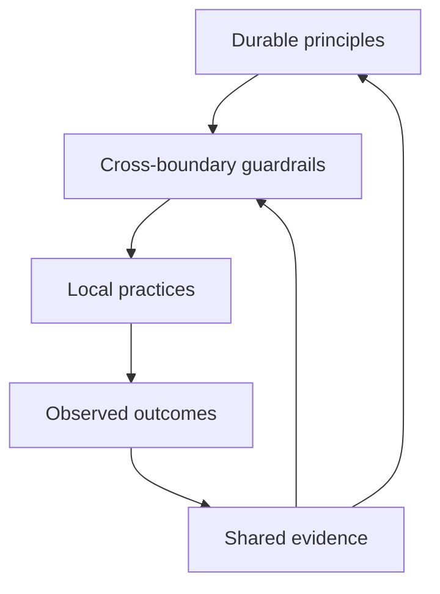

# Scaling Without Bureaucracy

## Decision supported

Decide which engineering guidance remains stable across an organization, which risks justify shared guardrails, and which practices should stay with the people closest to the work.

This guide is for engineering leaders, platform and domain owners, and business leaders who need consistency without forcing every team into the same ceremony or technology.

## Stable core and local adaptation

This model answers: **How can guidance scale across teams without turning local judgment into central process?**

> **Working maxim:** Scale the decision, not the ceremony.

Principles remain stable while evidence can change a guardrail or reveal that a principle's stated boundary is incomplete. Teams adapt local practice as long as shared risks and contracts remain protected.

## Four responsibility layers

### Stable core

Keep durable decision heuristics, evidence standards, and authoritative terminology stable across the organization. Change them when repeated evidence changes the reasoning, not when a new tool or framework becomes popular.

### Cross-boundary guardrails

Centralize a guardrail when failure can cross team boundaries or create shared safety, compliance, data, security, compatibility, or operational harm. State the protected condition, enforcement owner, exception path, and removal trigger.

### Local adaptation

Keep workflow, estimation technique, review timing, and improvement experiments local when their consequences remain within the team's owned boundary. Scrum, Kanban, continuous flow, and hybrid models are valid adapters rather than competing sources of engineering truth.

### Evidence feedback

Teams report outcomes, exceptions, control cost, and new failure conditions. Shared owners use that evidence to keep, adapt, or remove guardrails. Local success alone does not prove that one practice should become enterprise policy.

## Application by organizational scale

| Scale | Share across the boundary | Keep close to the work | Evidence of maturity |
| --- | --- | --- | --- |
| Team | Outcome, ownership, acceptance, and recovery expectations | Task flow, ceremonies, estimation method, and improvement experiments | The team can explain decisions, detect harm, and learn from results. |
| Multi-team or platform | Service contracts, dependency ownership, compatibility, escalation, and shared operational risk | Implementation and delivery choices that preserve the shared contract | Cross-team changes remain traceable and failures have an accountable recovery path. |
| Enterprise | Safety, compliance, identity, data, financial, and other organization-wide obligations | Domain decisions whose risk remains bounded and observable | Controls protect named consequences, exceptions are reviewable, and obsolete rules are removed. |

Maturity is the ability to make, communicate, verify, and revise consequential decisions. More committees, documents, gates, or standard technologies do not prove maturity.

## Scaling method

1. Name the harmful outcome or decision inconsistency that crosses a boundary.
2. Identify the smallest shared principle, contract, or guardrail that protects it.
3. Leave implementation and ceremony choices local unless they can violate that protection.
4. Define evidence, exception authority, and a trigger to review or remove the guardrail.
5. Compare the control's observed benefit with delay, workarounds, and ownership cost.

## Failure modes

- Treating one successful team's practice as a universal operating model.
- Standardizing technology when the real shared need is a contract or outcome.
- Adding approval layers without a named risk or decision owner.
- Allowing local autonomy to hide cross-boundary harm or incompatible contracts.
- Measuring maturity by process adoption instead of decision and recovery capability.
- Keeping a guardrail after its protected condition or enforcement owner disappears.

## Review evidence

- [ ] Stable principles state their boundaries and trade-offs.
- [ ] Shared guardrails name the cross-boundary harm they protect.
- [ ] Local teams retain decisions whose consequences remain inside their authority.
- [ ] Exceptions, outcomes, and control cost return to an accountable shared owner.
- [ ] Evidence can remove or adapt a rule as well as add one.

## Maintenance trigger

Review this guide when organization-wide controls repeatedly create workarounds, cross-team failures escape local ownership, or a new obligation changes which consequences require shared authority.
